<p align="center">
  
</p>

<div align="center">


</div>

# PassCheck — Password Strength Analyser

A production-ready CLI tool that evaluates password strength across multiple security dimensions, returning a detailed breakdown, numerical score, and actionable improvement suggestions.

---

## 🏗️ Architecture

```bash
SecureArmor/
├── assets/
├── passcheck/
│   ├── __init__.py        
│   ├── analyzer.py      
│   ├── cli.py           
│   ├── constants.py     
│   ├── display.py  
│   ├── main.py     
│   ├── models.py        
│   ├── scoring.py 
│   └── utils.py      
├── tests/
│   └── test_analyzer.py   
└── README.md
```

---

## ⚙️ Installation

**Requirements:** Python ≥ 3.10, `click`, `colorama`
```bash
# 1. Clone or unzip the project
git clone https://github.com/RakkaEvandra06/SecureArmor.git
cd SecureArmor

# 2. Install dependencies
pip install click colorama

# 3. Install the package (editable mode for development)
pip install -e . --no-build-isolation
```

### ✅ Verify installation
```bash
passcheck --help
```

If you don't want to install the package, run it directly:
```bash
python3 -m passcheck.cli check
# or
python3 -c "from passcheck.cli import main; main()" check
```

---

## 🚀 Usage

### Single password via flag (⚠ insecure — stored in shell history)

```bash
passcheck check -p "MyP@ssw0rd!"
passcheck check --password "MyP@ssw0rd!"
```

### JSON output (for scripting)

```bash
passcheck check -p "MyP@ssw0rd!" --json
echo "secret" | passcheck batch --json
```

### Batch mode (stdin)

```bash
cat passwords.txt | passcheck batch
cat passwords.txt | passcheck batch --json
echo "hunter2" | passcheck batch
```

### Show password in output

By default the password is partially masked (`H*********!`). Use `--show-password` to display it:
```bash
passcheck check -p "MyP@ss!" --show-password
```

### Help

```bash
passcheck --help
passcheck check --help
passcheck batch --help
```

---

## Development

No external test runner required — the test file uses stdlib `unittest`:
```bash
python3 tests/test_analyzer.py
```

If you have `pytest` installed:
```bash
pytest tests/ -v
```

---

## ⚠️ Disclaimer

This toolkit is developed for educational and research purposes.

<p align="center">
  
</p>