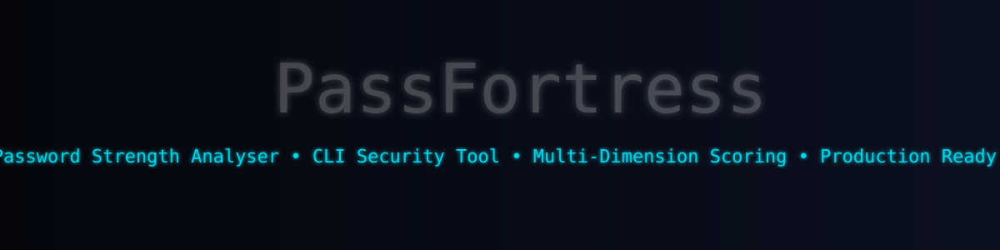

<p align="center">
  
</p>

<div align="center">

[](https://www.python.org/)
[](https://github.com/RakkaEvandra06/passcheck/releases)
[](LICENSE.txt)
[](https://github.com/RakkaEvandra06/passcheck)
[](https://github.com/RakkaEvandra06/passcheck)
[](https://github.com/RakkaEvandra06/passcheck)

</div>

# SecureArmor — Password Strength Analyser

**PassFortress** is a CLI toolkit that evaluates password strength across 13 distinct security dimensions, returning a detailed per-criterion breakdown, a numeric score (0–100), estimated entropy in bits, and actionable improvement suggestions all from a single command.

---

## Table of Contents

- [About the Project](#about-the-project)
- [Architecture](#architecture)
- [Installation](#installation)
- [Verify Installation](#verify-installation)
- [Usage](#usage)
- [Development](#development)
- [Contributing](#contributing)
- [License](#license)
- [Disclaimer](#disclaimer)

---

## 💡 About the Project

SecureArmor was built around the idea that password feedback should be **specific, honest, and actionable** not just a colour-coded "weak / strong" bar. Under the hood it combines multiple heuristics into a single 0–100 score, with each criterion carrying independent weight:

- **Multi-dimensional scoring** — 13 criteria covering length, character class presence, variety, uniqueness, entropy, common-password detection, and keyboard-pattern recognition.
- **Entropy estimation** — a blended pool-size / Shannon model that quantifies true unpredictability, not just rule compliance.
- **Leet-speak normalisation** — common substitutions (`@→a`, `0→o`, `$→s`, …) are decoded before the common-password check, so `P@$$w0rd` is flagged just like `Password`.
- **Safe by default** — the raw password is never stored or logged; only a masked form (`M*******!`) is kept in the result object.
- **Machine-readable output** — every command supports `--json` for NDJSON-compatible output suitable for scripting, CI pipelines, and downstream tooling.
- **Batch support** — pipe a newline-delimited list of passwords to `passcheck batch` for bulk analysis.

---

## 🏗️ Architecture

```bash
SecureArmor/
├── assets/                # Banner images and static assets
├── passcheck/
│   ├── __init__.py        # Public API surface   
│   ├── analyzer.py        # Core PasswordAnalyzer — all 13 criterion checks
│   ├── cli.py             # Click-based CLI (check / batch sub-commands)
│   ├── constants.py       # Score weights, thresholds, pattern lists
│   ├── display.py         # Coloured terminal rendering (human-readable)
│   ├── main.py            # python -m passcheck entry point
│   ├── models.py          # Immutable dataclasses: CriterionResult, PasswordAnalysis
│   ├── scoring.py         # score_bar(), criteria_summary(), AnalysisSummary
│   └── utils.py           # is_utf_terminal(), masked_password()
├── tests/
│   └── test_analyzer.py   # Test suite (unittest / pytest compatible)
├── LICENSE.txt
├── pyproject.toml         # Build metadata, tool configuration
└── README.md
```

---

## ⚙️ Installation

**Requirements:** Python ≥ 3.10, `click >= 8.0`, `colorama >= 0.4`

```bash
# 1. Clone the repository
git clone https://github.com/RakkaEvandra06/SecureArmor.git
cd SecureArmor

# 2. Install runtime dependencies
pip install click colorama

# 3. Install the package in editable mode (recommended for development)
pip install -e . --no-build-isolation
```

### Verify installation
```bash
passcheck --help
```

If you don't want to install the package, run it directly:
```bash
python3 -m passcheck check
# or
python3 -c "from passcheck.cli import main; main()" check
```

---

## 🚀 Usage

### Interactive mode (recommended, most secure)

```bash
passcheck
# or explicitly:
passcheck check
```

### Single password via flag ⚠

```bash
passcheck check -p "MyP@ssw0rd!"
passcheck check --password "MyP@ssw0rd!"
```

### JSON output

```bash
passcheck check -p "MyP@ssw0rd!" --json
echo "hunter2" | passcheck batch --json
```

Sample JSON output:

```json
{
  "password_masked": "G*******2",
  "password_length": 9,
  "score": 67,
  "effective_max_score": 100,
  "score_percent": 67,
  "strength_label": "Strong",
  "strength_color": "green",
  "entropy_bits": 38.56,
  "passed_count": 8,
  "total_criteria": 13,
  "suggestions": [
    "Aim for 12+ characters for a sizeable length bonus.",
    "Consider 20+ characters for maximum length credit.",
    "Add a special character (e.g. ! @ # $ % ^ & *).",
    "Increase length and character variety to raise entropy."
  ],
  "criteria": [
    {
      "name": "Minimum Length",
      "passed": true,
      "skipped": false,
      "score": 9,
      "max_score": 9,
      "detail": "9 chars (minimum 8)",
      "suggestion": "",
      "skip_reason": null
    },
    {
      "name": "Not a Common Password",
      "passed": true,
      "skipped": false,
      "score": 9,
      "max_score": 9,
      "detail": "not found in common password list",
      "suggestion": "",
      "skip_reason": null
    }
  ]
}
```

### Batch mode (stdin)

```bash
cat passwords.txt | passcheck batch
cat passwords.txt | passcheck batch --json
echo "hunter2"   | passcheck batch
```

### Help

```bash
passcheck --help
passcheck check --help
passcheck batch --help
```

---

## 🛠️ Development

### Running tests

```bash
# Without pytest
python3 tests/test_analyzer.py

# With pytest (recommended, enables coverage reporting)
pytest tests/ -v
```

### Linting & formatting

```bash
# Install dev extras
pip install -e ".[dev]"

# Format
black passcheck/
isort passcheck/

# Lint
flake8 passcheck/
mypy passcheck/
```

### Build & publish

```bash
python -m build
twine check dist/*
twine upload dist/*
```

---

## 🤝 Contributing

Contributions are welcome! Here's how to get started:

1. **Fork** the repository and create your branch from `main`.
2. **Install** dev dependencies: `pip install -e ".[dev]"`.
3. **Make your changes** — add or update tests to cover new behaviour.
4. **Run the full suite** and confirm coverage stays ≥ 80 %: `pytest tests/ -v`.
5. **Lint** your code: `black . && isort . && flake8 . && mypy passcheck/`.
6. **Open a Pull Request** with a clear description of what changed and why.

Please keep pull requests focused on a single concern. For larger changes, open an issue first to discuss the approach.

---

## 📜 License

Distributed under the **MIT License**. See [`LICENSE.txt`](LICENSE.txt) for the full text.

---

## ⚠️ Disclaimer

SecureArmor is developed for **educational and research purposes**. While it applies established heuristics to estimate password strength, no tool can guarantee that a password is secure in every context. Always pair strong passwords with multi-factor authentication and a reputable password manager.

<p align="center">
  
</p>